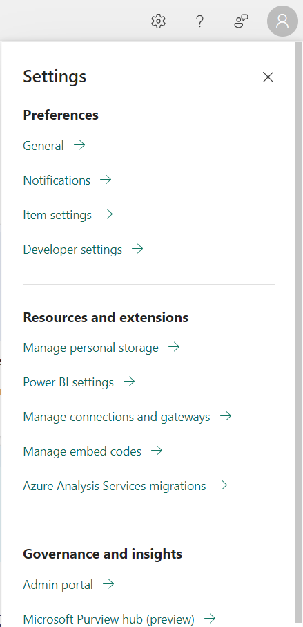

# Lab 01 - Setting up Environment

**Objectives**:

- In this lab we will learn to enable Microsoft Fabric trail.

- We will navigate through Admin Portal and will check the admin
  capacity.

## Task 1 - Enabling the Fabric Trial License

1.  Open a browser and paste the [Fabric
    Trial](https://www.microsoft.com/en-us/microsoft-fabric/getting-started)
    URL

2.  Click on **Try for Free.**

3.  Enter your credentials.

4.  Once you enter your credentials and selected Next. You will be
    navigated to Microsoft Fabric Home page.

5.  You must make sure that the Trial licence is enabled by selecting
    the account on top-right corner of the Fabric home page. Select
    **Free Trial.**

6.  Select **Free Trial.**

7.  Once it is enabled, select **Fabric Home Page.** You will be
    navigated to Fabric Home Page.

## Task 2 - Enable Fabric tenant switch setting

If you're a Capacity administrator or a tenant admin, you can view,
verify, or change the Fabric switch. 

1.  Click on **Settings** icon on the top-right corner of the Home page.
    Select **Admin Portal** from the list

2.  Navigate to **Tenant settings \> Users can create Fabric items.**
    Enable the option if it is disabled.

## Task 3 - Access to Capacity administrator

If you're the capacity or Fabric administrator, from the upper right
corner of Fabric, select the gear icon.

1.  On the **Admin portal**, for a Fabric trial, select **Capacity
    settings** and then choose the **Trial** tab.

2.  You must make sure that the admin name is reflecting in the Capacity
    Admins column

**Summary**

You have successfully enabled Fabric License and checked the capacity
settings
