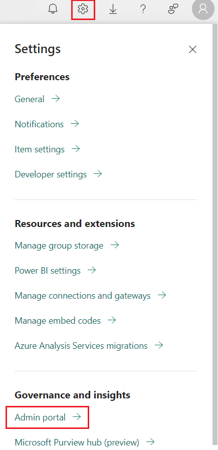
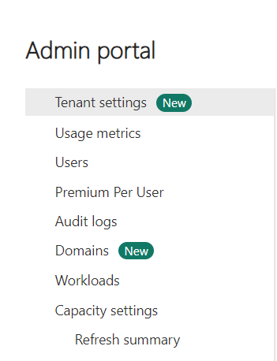
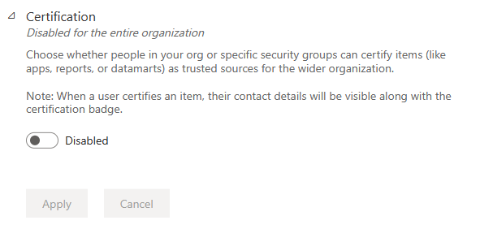
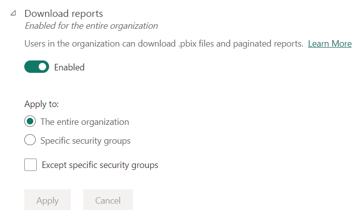
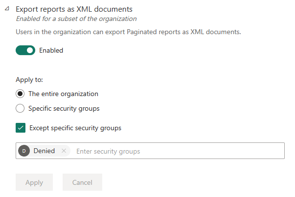
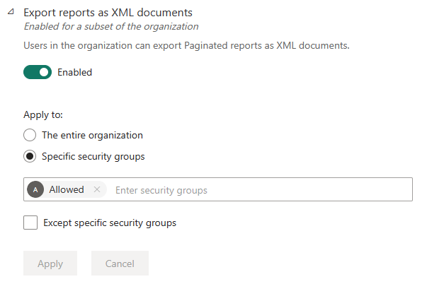
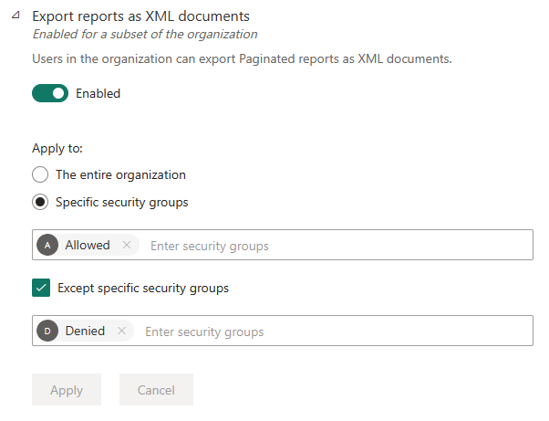

# Lab 03 - Setting up workspace tenant

Objectives

- In this Lab, you will check the tenant settings in the Fabric and
  explore the settings

## Task 1 - Configuring the Tenant settings

1.  Login into [Microsoft Fabric](https://app.fabric.microsoft.com/)
    with your credentials and you will be navigated to the home page.

2.  Go to the admin portal by selecting Setting icon (Gear icon) on the
    top right corner of the home page.

3.  Select **Tenant settings**.

4.  Check the below options accordingly:

- **Disabled for the entire organization**: Scroll down to **Export and
  sharing settings** and search for **Certification** option. This
  feature disabled will allow no one in your organization can use this
  feature.

- **Enabled for the entire organization**: Under **Export and sharing
  settings** and search for **Download reports** option. This option
  enabled will allow everyone in your organization to use this feature.

- **Enabled for the entire organization except for certain groups**:
  Under **Export and sharing settings** and search for **Export reports
  as XML documents** option. Everyone in your organization can use this
  feature except for users who belong to the specified groups.

- **Enabled for a subset of the organization**: We can enable specific
  security groups in your organization are allowed to use this feature.

- **Enabled for specific groups except for certain groups**: Here,
  members of the specified security groups are allowed to use this
  feature, unless they also belong to an excluded group. This approach
  ensures that certain users don't have access to the feature even if
  they're in the allowed group. The most restrictive setting for a user
  applies.

**Summary :**

You have successfully checked the tenant settings in the Fabric that are
required to execute the further labs
