# Lab 04 - Assigning granular permission to Lakehouse items

Objectives:

- In this Lab, you will enable OneDrive access and share the items

- You will also learn on how to grant and manage the access.

## Task 1: Enable OneDrive access to the Microsoft Account

1.  Open a browser and paste the
    [OneDrive](https://www.microsoft.com/en-in/microsoft-365/onedrive/online-cloud-storage)
    URL. Select **Sign in.**

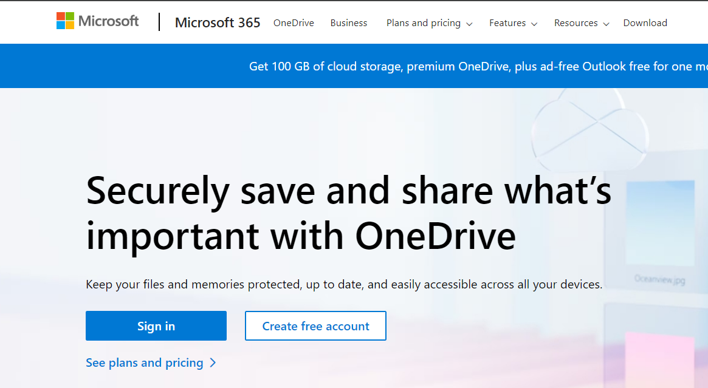

2.  Sign in with your Office tenant credentials.

3.  Once you sign in, click on **Your OneDrive is ready** option to
    navigate to the Homepage of Onedrive.

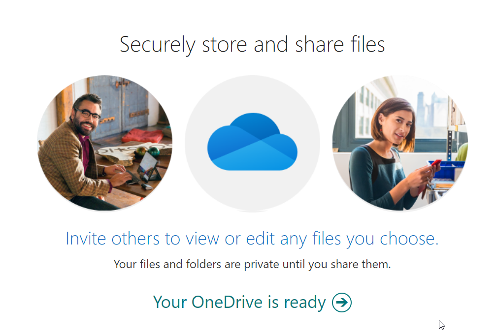

**Share an item via link**

1.  Login to [Fabric Home page](https://app.fabric.microsoft.com/) with
    your office credentials.

2.  In the workspace created, Create a new item. For this lab, let us
    add a **Scorecard**.

3.  Click on **New** and click on **Scorecard**.

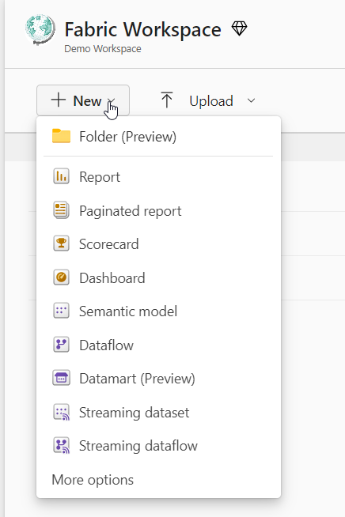

4.  Provide a name to the **Scorecard** as !!**Fabric Demo!!** by
    clicking on **Edit** beside the default name

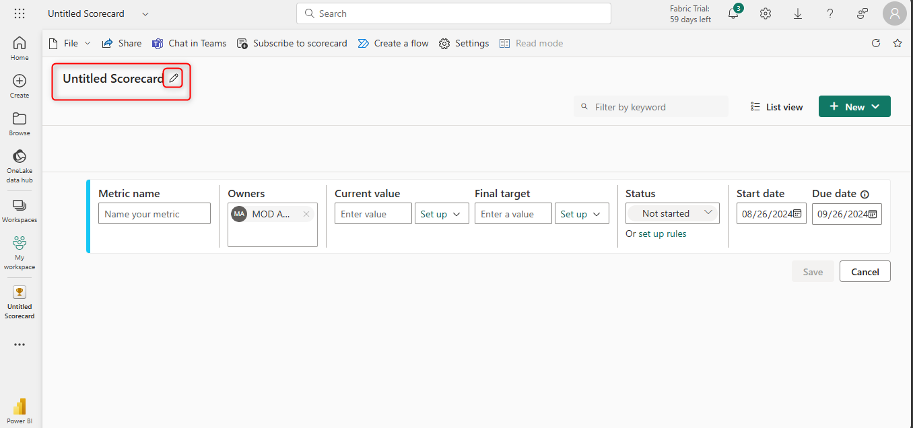

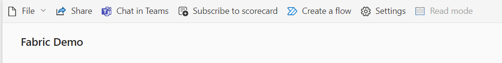

5.  Navigate back to the workspace and in the list of items, or in an
    open item, select the scorecard and select
    the **Share** button .

> 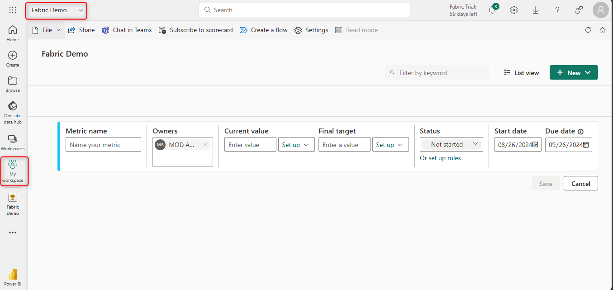

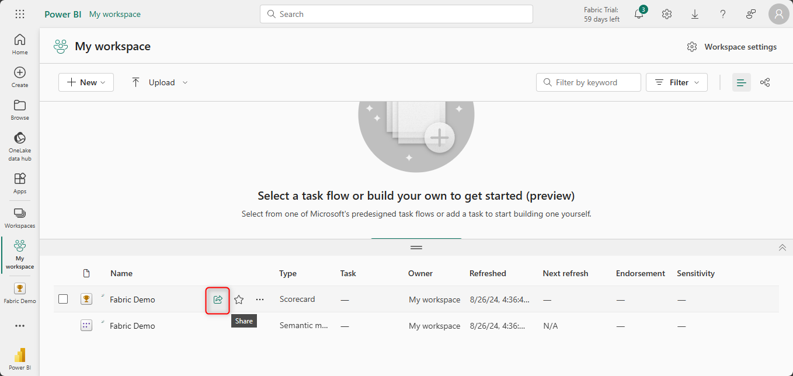

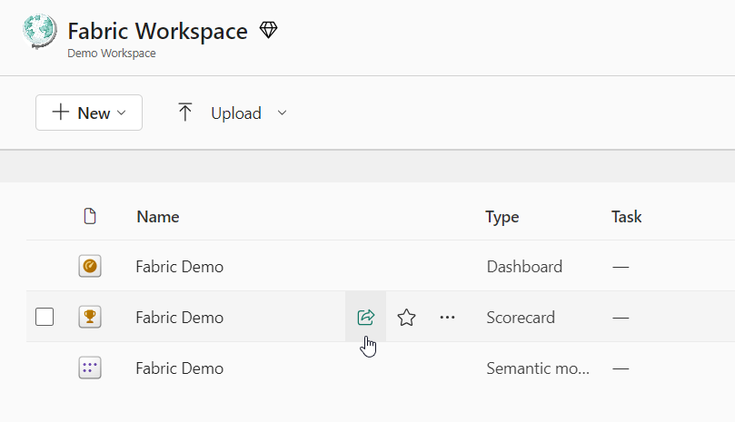

6.  The **Create and send link** dialog opens. Select **People in your
    organization can view**.

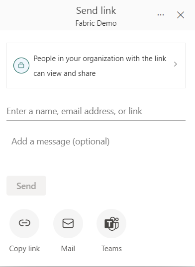

7.  The **Select permissions** dialog opens. Select the option as
    **People in your organization**.

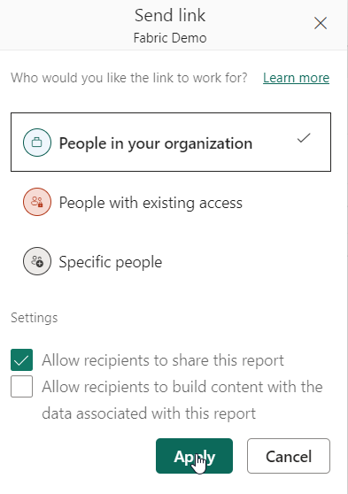

**Note :**

You have the following options:

- **People in your organization** This type of link allows people in
  your organization to access this item. It doesn't work for external
  users or guest users. Use this link type when:

  - You want to share with someone in your organization.

  <!-- -->

  - You're comfortable with the link being shared with other people in
    your organization.

  <!-- -->

  - You want to ensure that the link doesn't work for external or guest
    users.

<!-- -->

- **People with existing access** This type of link generates a URL to
  the item, but it doesn't grant any access to the item. Use this link
  type if you just want to send a link to somebody who already has
  access.

<!-- -->

- **Specific people** This type of link allows specific people or groups
  to access the report. If you select this option, enter the names or
  email addresses of the people you wish to share with. This link type
  also lets you share to guest users in your organization's Microsoft
  Entra ID. You can't share to external users who aren't guests in your
  organization.

**Note -** If your admin has disabled shareable links to **People in
your organization**, you can only copy and share links using
the **People with existing access** and **Specific people** options.

8.  Choose the permissions you want to grant via the link.  
    Select **Apply.** Then select **Send.**

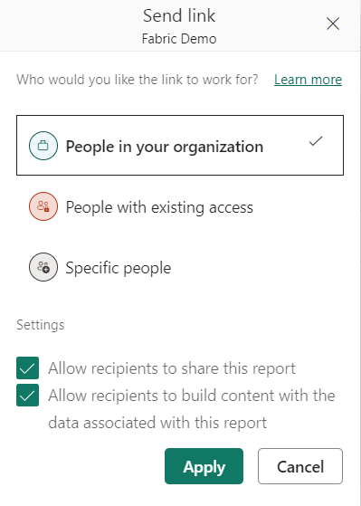

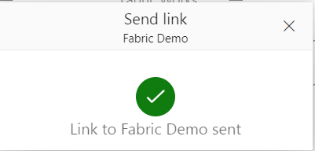

Links that give access to **People in your organization** or **Specific
people** always include at least read access. However, you can also
specify if you want the link to include additional permissions as well.

**Note -** The **Additional permissions** settings vary for different
items. Learn more about the [**item permission
model**](https://learn.microsoft.com/en-us/fabric/get-started/share-items#item-permission-model).
Links for **People with existing access** don't have additional
permission settings because these links don't give access to the item.

9.  Select another item by creating another scoreboard. In the **Create
    and send link** dialog, you have the option to copy the sharing
    link, generate an email with the link, or share it via Teams.

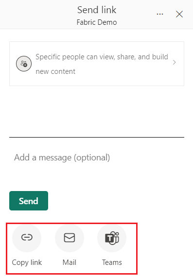

- **Copy link**: This option automatically generates a shareable link.
  Select **Copy** in the **Copy link** dialog that appears to copy the
  link to your clipboard.

- **by Email**: This option opens the default email client app on your
  computer and creates an email draft with the link in it.

<!-- -->

- **by Teams**: This option opens Teams and creates a new Teams draft
  message with the link in it.

10. You can also choose to send the link directly to **Specific
    people** or groups (distribution groups or security groups). Enter
    their name or email address, optionally type a message, and
    select **Send**. An email with the link is sent to your specified
    recipients.

When your recipients receive the email, they can access the report
through the shareable link.

## Task 2 - Manage item links

1.  Select **Fabric Demo** Scoreboard. To manage links that give access
    to the item, in the upper right of the sharing dialog, select
    the **Manage permissions** icon:

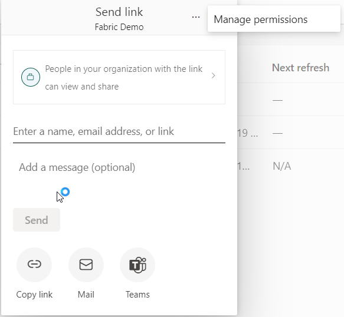

2.  The **Manage permissions** pane opens, where you can copy or modify
    existing links or grant users direct access. To modify a given link,
    select three horizontal dots(**…**).

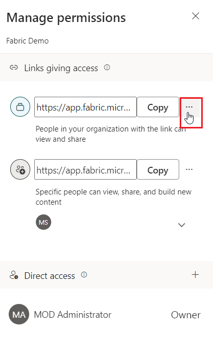

3.  In the **Manage permissions** pane, you can modify the permissions
    included in the link, people who can use this link, or delete the
    link. Select **Save** after your modification.

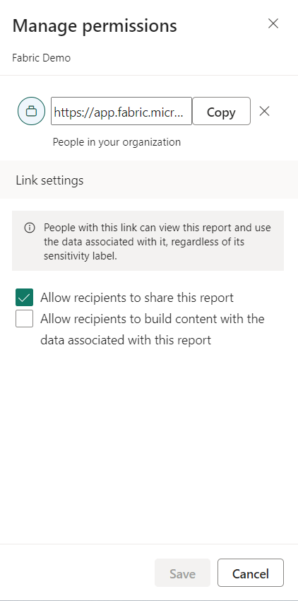

This image shows the **Manage Permissions** pane when the selected
audience is **Specific people can view and share**. Note that the pane
enables you to modify who can use the link.

## Task 3 - Grant and manage access directly

In some cases, you need to grant permission directly instead of sharing
link, such as granting permission to service account, for example.

1.  Select **Manage permission** from the context menu of the Scoreboard
    that is created.

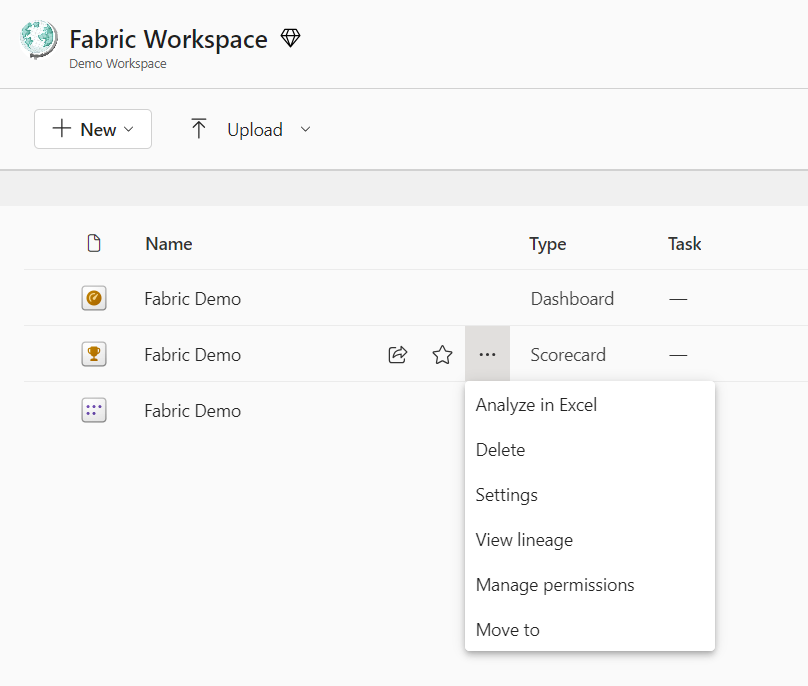

2.  Select **Direct access**.

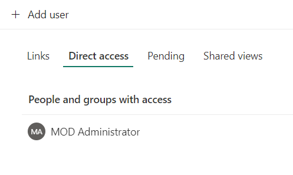

3.  Select **Add user**.

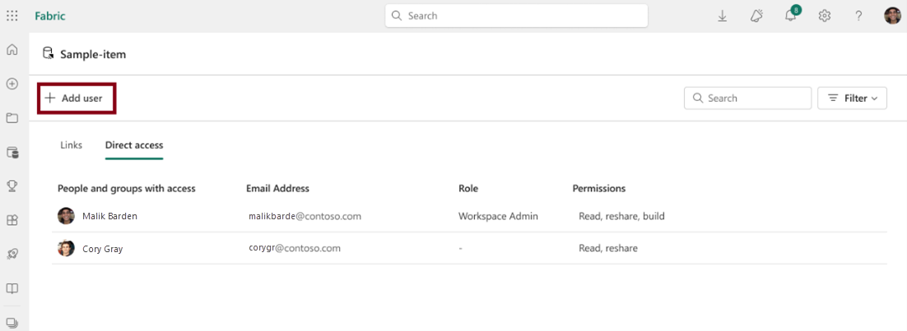

4.  Enter the names of people or accounts that you need to grant access
    to directly. Select the permissions that you want to grant. You can
    also optionally notify recipients by email.

5.  Select **Grant Access**.

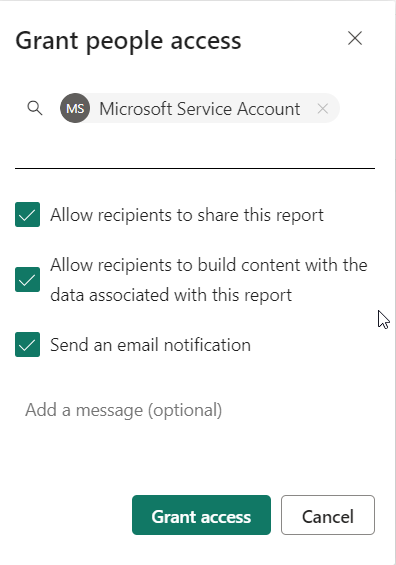

6.  You can see all the people, groups, and accounts with access in the
    list on the permission management page. You can also see their
    workspace roles, permissions, and so on. By selecting the context
    menu, you can modify or remove the permissions.

Summary

- You have enabled OneDrive access and share the items via using the
  link and also granted the access directly.
