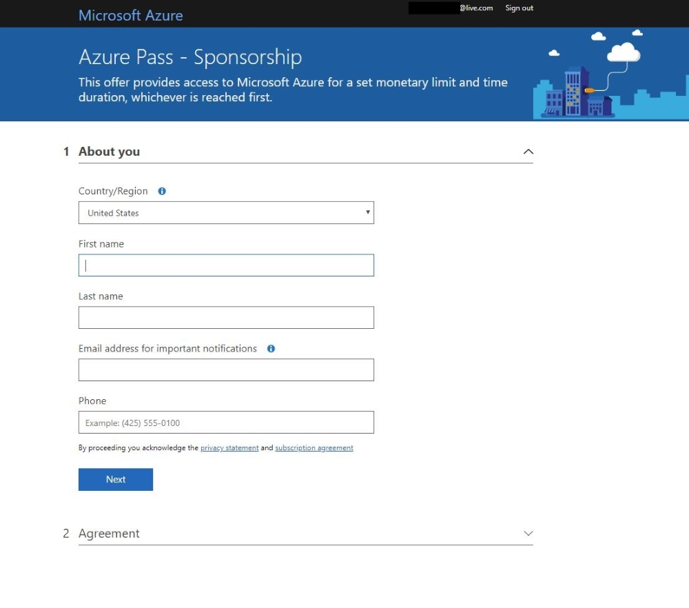
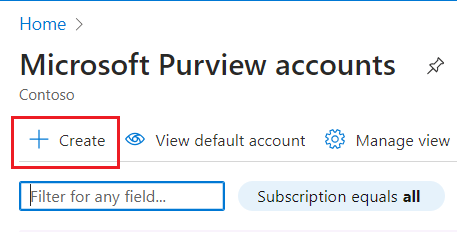
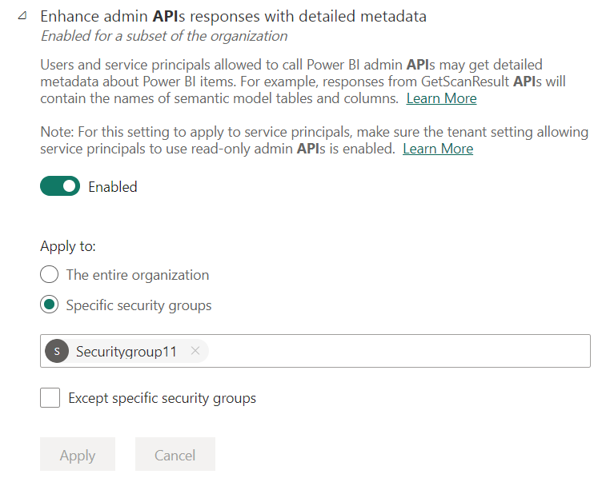
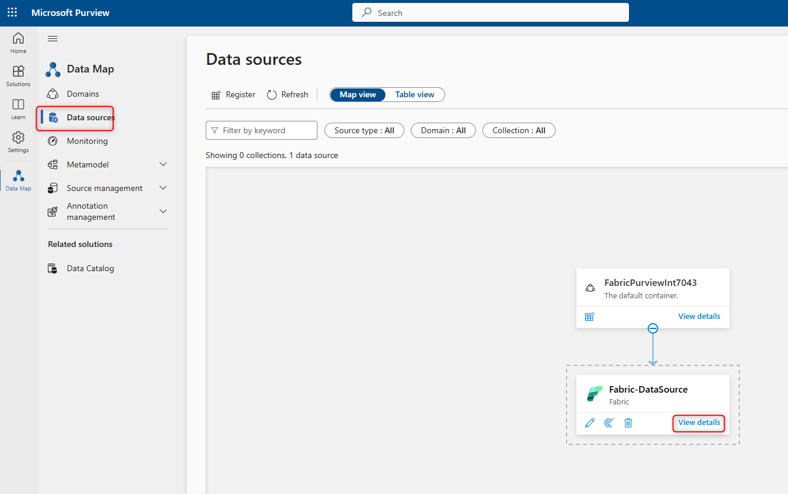

**Lab 05 - Integrating Microsoft Fabric with Microsoft Purview**

**Objectives**

- In this Lab, you redeem an Azure pass and create resource group in the
  Azure portal.

- You create Microsoft Purview account and register Fabric tenant and
  check the authentication

- You create and run the scan

## Task 1 - Redeem Azure Pass

1.  Open a browser and navigate to: **!!www.microsoftazurepass.com!!**

> It is recommended you close all browsers and open a new In-Private
> Browser session. Other log-ins can persist and cause errors during the
> activation step.

2.  Click the **Start** button to get started.

>  alt="screenshot showing redemption start button" />

3.  Enter your **Office 365 tenant credentials** and select **Sign In**.

>  alt="screenshot showing login form" />

4.  Click **Confirm Microsoft Account** if the correct email address is
    listed.

>  alt="screenshot showing confirm microsoft account button" />

5.  Enter your **Azure Pass** promo code in the Enter Promo code box and
    click “**Claim Promo Code**”.

>  alt="screenshot showing promo code input field" />

6.  It may take up to 5 minutes to process the redemption.

>  alt="screenshot showing loading screen while promo code is being redeemed" />

#### Activate your subscription

1.  When the redemption process is completed, it will redirect to the
    sign up page.

2.  Enter your account information and click **Next**.

>  alt="screenshot showing sign up form to enter account information" />

3.  Click the agreement check box and click the Sign-up button.

4.  It may take a few minutes to process the request.

>  alt="screenshot showing agreement checkbox and sign up button" />

5.  Your **Azure subscription** is ready

## Task 2 – Create a resource Group

1.  Login to Azure portal. Enter resource group in the search area.

2.  Select **Create.**

3.  Enter the below details:

    1.  Subscription - Your Azure subscription

    2.  Resource Group – FabricPurview

    3.  Select **Review + Create**

4.  On the next page click on Create.

4.  The resource group is created.

## Task 3 - Create an active Microsoft Purview account

1.  Open a browser, sign-in to the [Azure
    portal](https://portal.azure.com/) with your Office 365 credentials.

2.  Search for **Microsoft Purview** in the Azure portal.

3.  Select **Create** to create a new Microsoft Purview account.

4.  Enter the below details

    1.  Subscription – Your azure subscription

    2.  Resource Group – **FabricPurview**

    3.  Microsoft Purview account name – **FabricPurviewInt**

    4.  Select **Review+Create**

5.  Click on the **Create** button once the validation passed screen
    appeared.

6.  Once we click on the **Create** button the Deployment will start,
    and it will take around 5 minutes for the deployment to complete.

5.  A Purview account is created. Select **Go to resource**

6.  Scroll down and select **Open Microsoft Purview Governance
    Portal(new)**

7.  On the **Welcome to the new Microsoft Purview portal!** Window,
    agree to the terms of data flow and click on **Get started.**

## Task 4 - Register Fabric tenant

While you are in the Microsoft Purview Home page, we will register the
Fabric tenant

1.  Select **Data Map**

2.  On the left side navigation pane, select **Data sources** and then
    select **Register**.

3.  Select **Fabric** as your data source and click on **Continue**.

4.  Give your Fabric instance a friendly name

    1.  Data source name – **Fabric Datasource**.

    2.  Select **Register.** The data source is added successfully.

## Task 5 - Authenticate to Fabric tenant

1.  Switch back to  [Azure portal](https://portal.azure.com/), search
    for **Microsoft Entra ID**.

2.  Expand **Manage** and select **Groups**.

3.  Select **New group.**

4.  Enter the below details and click on **Create.**

    1.  Group Type: **Security**

    2.  Group Name – Security11

5.  Refresh the page to the newly created group in the list.

6.  On the Newly created Group page navigate to **members** on the left
    hand pane**,** click on add members, Select You Microsoft Purview
    Managed Identity ( the Microsoft Purview Account name that you
    created). Click on **Select.**

7.  You will get a success notification that 1 member selected.

## Task 6 - Associate the security group with Fabric tenant

1.  Switch back to Fabric Portal.

2.  Select the **Settings** icon and Select **Admin Portal.**

3.  Select the **Tenant settings** page. Search for  **Admin API
    settings** and then search for **Allow service principals to use
    read-only admin APIs**. Enable the toggle if it is not enabled. Add
    your Security group and select **Apply**

4.  Perform the above steps

    1.  **Enhance admin APIs responses with detailed metadata** 

    2.  **Enhance admin APIs responses with DAX and mashup
        expressions** 

no

## Task 7 - Create scan

1.  Switch back to Microsoft Purview Portal.

2.  Navigate to **Data sources** \> Select your **Fabric Datasource.**
    Select **View Details**

3.  Click on **New Scan.**

4.  Enter/Update the below details and click on **Continue.**

    1.  Name – **FabricPurviewScan**

    2.  Credential – **Microsoft Purview MSI (System)**

    3.  Select **Test Connection**

**Note** - If **Test Connection** failed, select **View Report** to see
the detailed status and troubleshoot the problem.

1.  **Access** - Failed status means the user authentication failed.
    Scans using managed identity will always pass because no user
    authentication required. If using service principal or delegated
    authentication, make sure your Key Vault credential was correctly
    set up and that Microsoft Purview has access to the key vault.

2.  **Assets (+ lineage)** - Failed status means the Microsoft Purview -
    Fabric authorization has failed. Make sure the Microsoft Purview
    managed identity is added to the security group associated in Fabric
    admin portal.

3.  **Detailed metadata (Enhanced)** - Failed status means the Fabric
    admin portal is disabled for the following setting - **Enhance admin
    APIs responses with detailed metadata**

<!-- -->

5.  On the **Scope your scan** page select **Yes(Purview)** to and click
    on **Continue.**

6.  On the **Set a scan trigger**, Select **Once** and click on
    **Continue.**

7.  On **Review new scan**, select **Save and run** to launch your scan.

8.  The scan is created.

9.  The scan takes a while to complete.

Summary

You create a Microsoft Purview account and register Fabric tenant and
check the authentication. You create and run the scan that you created.
