# Lab 06 - Configuring Domains and Sub Domains

**Objectives**

- In this Lab, you create Domain and Subdomains and assign workspaces

## Task 1 - Create a domain

To create domain, you must be a Fabric admin.

1.  Login to [Fabric Home Page](https://app.fabric.microsoft.com/) with
    your credentials.

2.  Select **Settings** icon on top right corner of the home page.

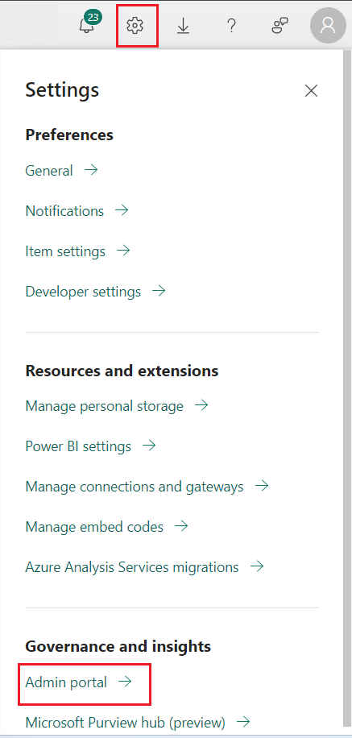

3.  Open the admin portal and select the **Domains** tab.

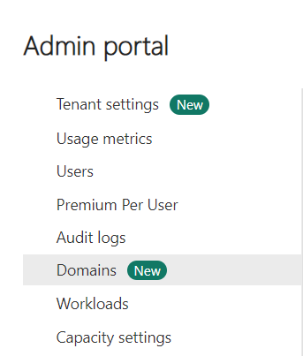

4.  On the **Domains** tab, select **Create a domain**.

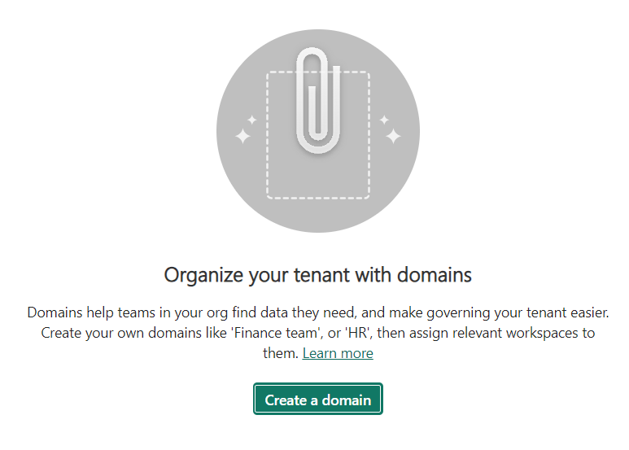

5.  In the **New domain** dialog that appears, provide a name
    (mandatory) – **TestDomain** and specify domain admins (optional).
    If you don't specify domain admins, you can do this later in the
    domain settings.

6.  Select **Create**. The domain is created

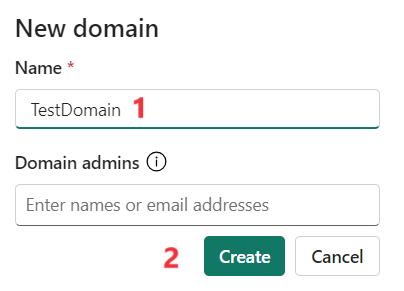

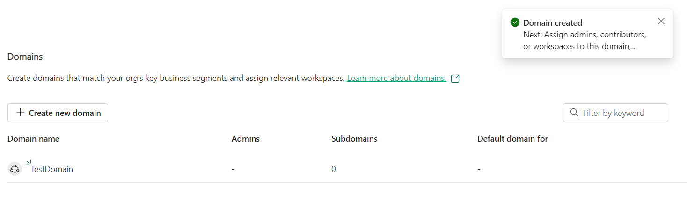

## Task 2 - Create subdomains

1.  To create a subdomain Open the newly created domain and select **New
    subdomain**.

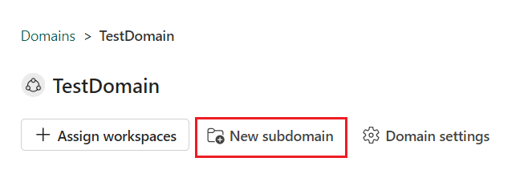

2.  Provide a name for the subdomain in the **New subdomain** dialog
    that appears. When done, select **Create**.

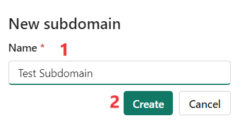

3.  The subdomain is created successfully.

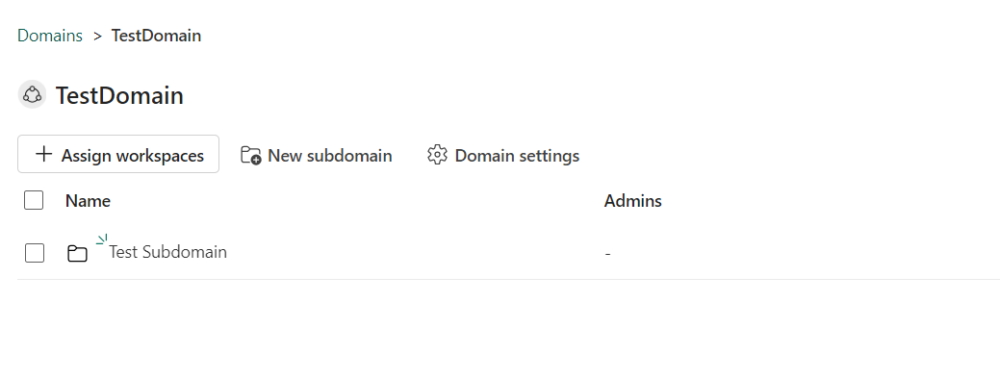

## Task 3 - Assign workspaces to domains and subdomains

1.  Go to the domain or subdomain's page and select **Assign
    workspaces**.

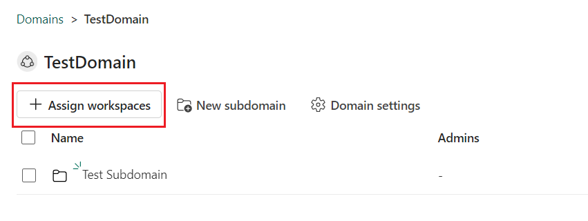

2.  In the **Assign workspaces to this domain** side pane, select
    **Assign by workspace name** to assign the workspaces.

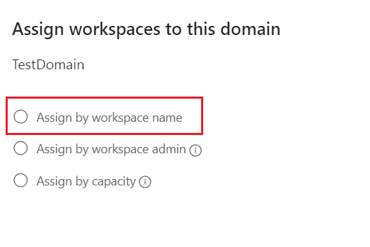

3.  Select the workspace that you had created and click on **Apply.**

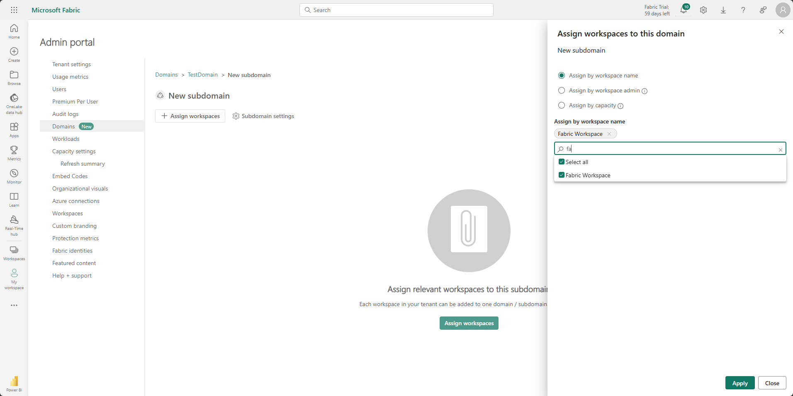

4.  The workspace is assigned successfully.

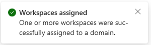

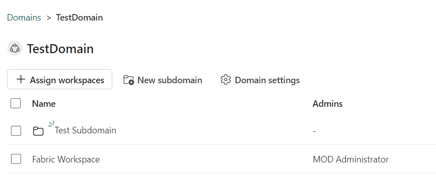

## Task 4 - Configure domain settings

1.  Click on **Domain settings** from the Domain or Subdomain page.

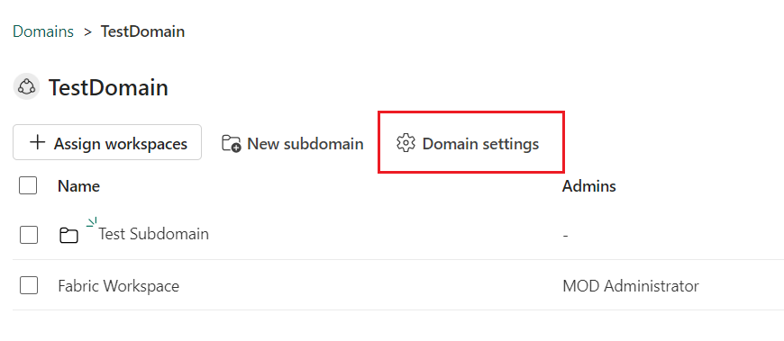

2.  Select **General settings** and then edit the **name** to **Fabric
    Domain Main** and **description** fields as desired.

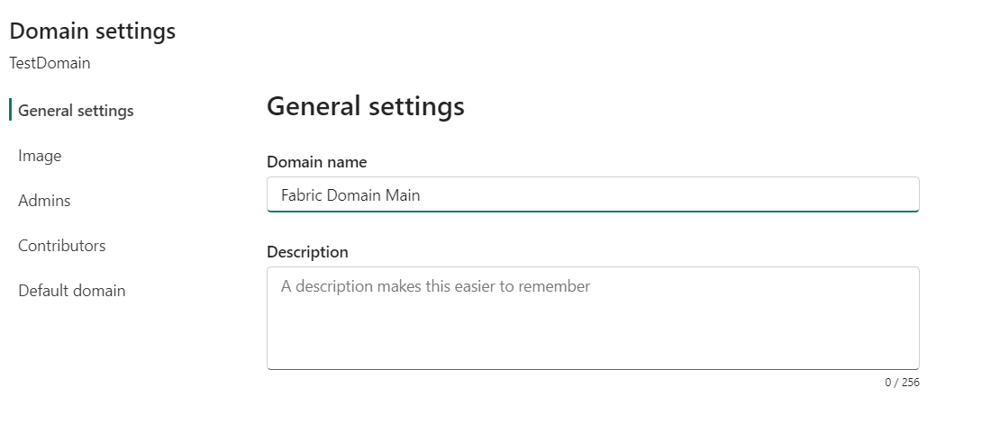

3.  Select **Apply**. The name is updated

4.  Select **Image** and then select **Select an image**.

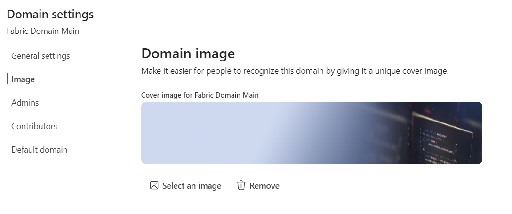

5.  Select an image. Select **Select.** The image is updated.

6.  Select **Admins** and then specify your admin account. When done,
    select **Apply**.

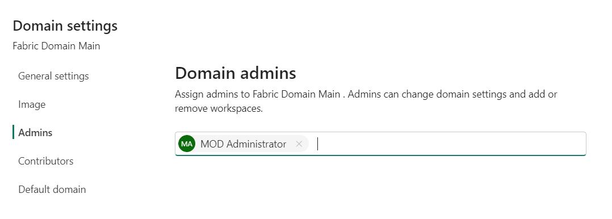

7.  Select **Contributors** and then specify who can assign workspaces
    to the domain. You can specify everyone in the organization
    (default), specific users/groups only, or you can allow only tenant
    admins and the specific domain admins to assign workspaces to the
    domain. When done, select **Apply**.

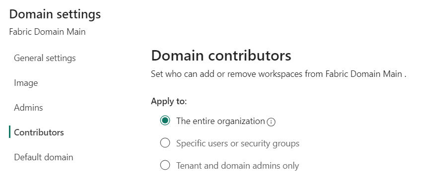

8.  Select **Default domain** and specify users and/or security groups.
    When you add people to the default domain list, unassigned
    workspaces they're admins of, and new workspaces they create, will
    automatically be assigned to the domain. Enter the admin account and
    Select **Apply.**

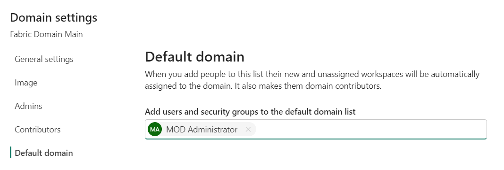

Summary

You have successfully created Domain and Subdomains and assigned
workspaces
