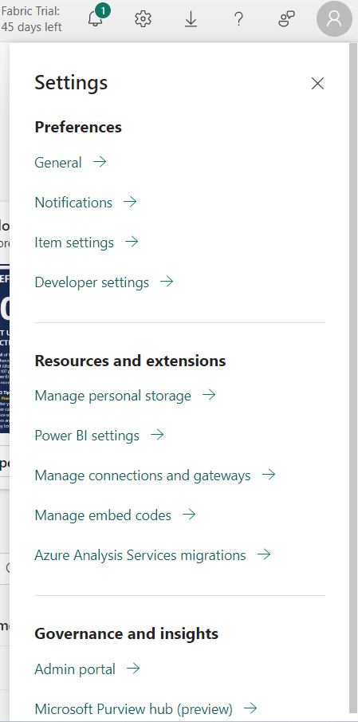
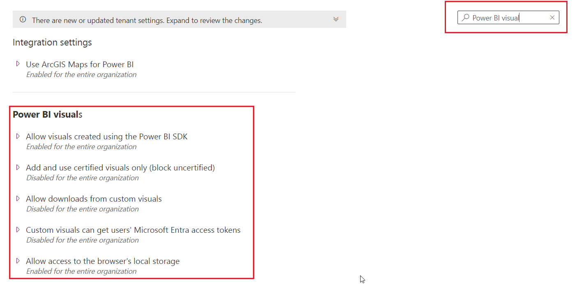
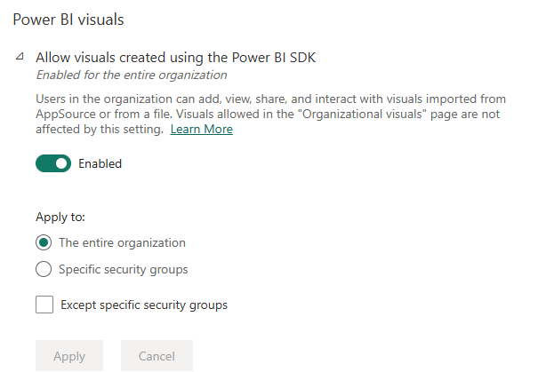
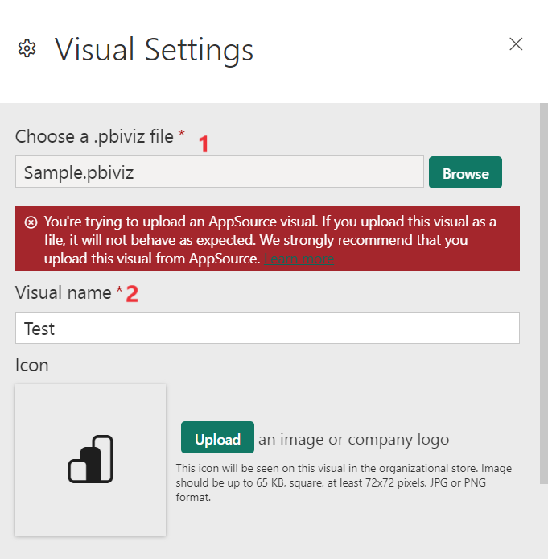
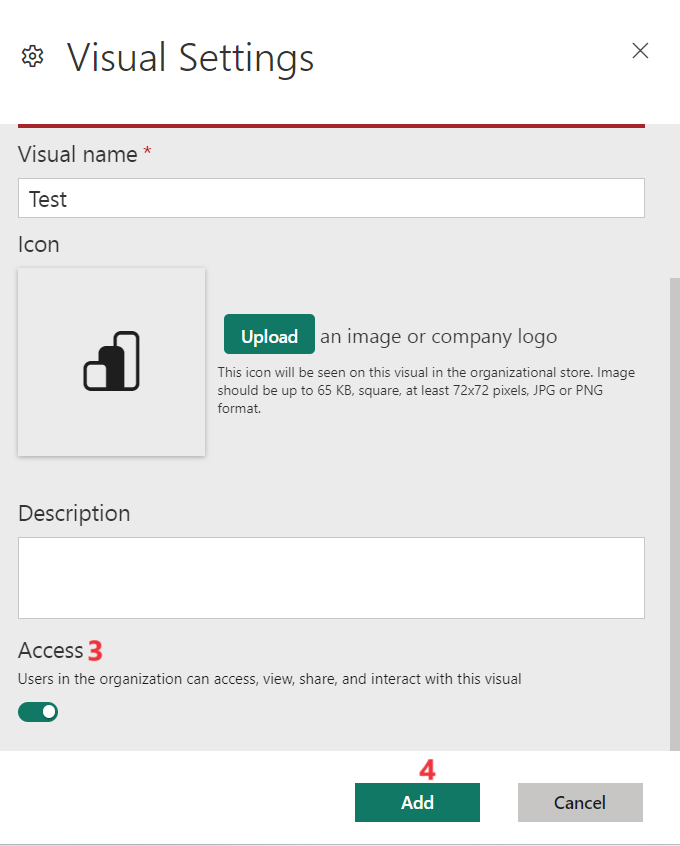
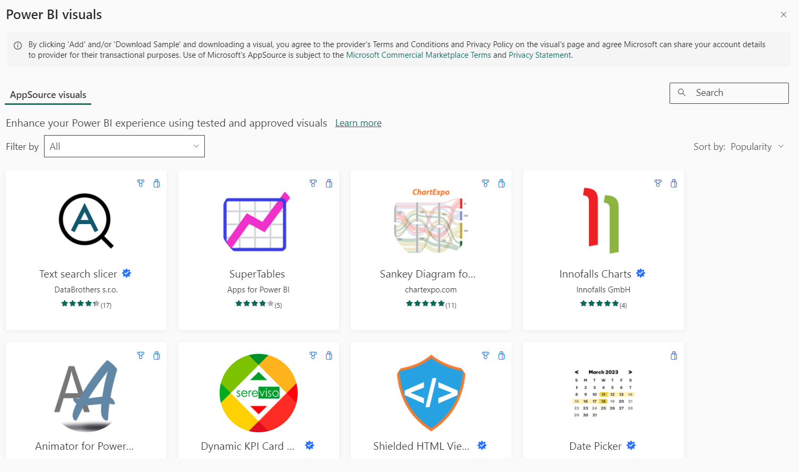

# Lab 08 - Managing Power BI visuals admin settings

Objectives

- In this Lab, you will enable the power BI visuals under tenant
  settings

- Adding the visual from the file

- Scheduling a Refresh and analyzing the logs in the PBO Desktop

## Task 1 – Configuring Power BI visuals tenant settings

1.  Open a browser. Login to [Fabric
    Portal](https://app.fabric.microsoft.com/) with your credentials.

2.  Select **Settings \> Admin Portal**

3.  Select **Tenant Settings.**

4.  Enter Power BI visuals in the search area. These settings allow you
    to control the following actions for Power BI visuals in your
    organization

5.  Select Enable for the visuals available.

    1.  **Allow visuals created using the Power BI SDK** – Toggle this
        button to enable uploading *.pbiviz* and AppSource visuals

> 

2.  **Allow access to certified Power BI visuals only –** When this
    setting is enabled , only certified Power BI visuals render in your
    organization's reports and dashboards.

3.  **Allow downloads from custom visuals onto your storage device –**
    When this setting is enabled, users can download data from a custom
    visual into a file on their storage device.

4.  **Obtain Microsoft Entra access token –** When this setting is
    enabled, AppSource Custom Visuals can obtain Microsoft Entra ID
    (formerly known as Azure Active Directory) access tokens with
    restricted audiences for signed-in users, utilizing
    the Authentication API. 

5.  **Allow custom visuals to store data on the user's local machine –**
    When this setting is enabled, allows visuals to store data on the
    browser's local storage which helps improve performance

## Task 2 - Add a visual from a file

1.  On the **Admin portal**, select **Organizational visuals**

2.  Select **Add visual \> From a file.**

3.  Enter the below fields

    1.  **Choose a .pbiviz file** - Select a visual file to upload.

    2.  **Name your visual** - Give a short title to the visual, so that
        report authors can easily understand what it does.

    3.  **Icon** - Upload an icon file to be displayed in the
        visualization pane.

    4.  **Description** - Provide a short description of the visual to
        give more context for the user.

    5.  **Access** - Select whether users in your organization can
        access this visual. This setting is enabled by default.

    6.  Select **Add**.

4.  After it's uploaded, the visual displays in the organizational
    visuals list.

**Task 3 - Add a visual from AppSource**

Use this method to add a new Power BI visual from AppSource. AppSource
Power BI visuals are automatically updated. Users in your organization
will always have the latest version of the visual.

1.  Select **Add visual \> From AppSource.**

2.  In the **Power BI visuals** window, find the AppSource visual you
    want to add, and select **Add**. After it's uploaded, the visual
    displays in the organizational visuals list.

## Task 3 – Scheduling a Refresh

1.  Select **Refresh summary** on the left navigation pane.

2.  Select the capacity you want to review from the **choose a
    capacity** dropdown menu.

3.  Use the **refresh** button to refresh the table's results.

4.  Click on the **Export** button to export a .csv file.

## Task 4 – Audit Logs in PBI Desktop

1.  To access the audit logs, in Fabric select **Audit logs,** and then
    select Go to **Microsoft 365 Admin Center**.

2.  Click on **Start recording user and admin activity,** on the next
    window click **Yes** complete organizational setup.

3.  You can search the audit logs using the filters in the list that is
    visible. When you combine filters, the search results show only
    items that match all of the filter criteria.

**Summary**

- You enabled the power BI visuals under tenant settings and added the
  visual from the file. Additionally, schedule a Refresh and analyze the
  logs in the PBO Desktop
